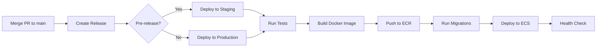

The Address API uses GitHub Actions for automated deployments to AWS ECS Fargate.

## Deployment overview



## Prerequisites

- PR merged to `main` branch
- All CI checks passing
- Appropriate AWS permissions (handled by GitHub Actions)

## Deploying to staging

### Step 1: Create a pre-release

1. Go to [Releases](https://github.com/commenda-eng/address-api/releases)
2. Click **Draft a new release**
3. Click **Choose a tag**
4. Enter a new tag: `v0.1.0-rc.1` (increment the version)
   - Format: `v{major}.{minor}.{patch}-rc.{release-candidate-number}`
   - Example: `v0.2.0-rc.1`, `v0.2.0-rc.2`, etc.
5. Set **Release title**: Same as tag (e.g., `v0.1.0-rc.1`)
6. Check ✅ **Set as a pre-release**
7. Click **Publish release**

### Step 2: Monitor deployment

GitHub Actions will automatically:

1. **Run tests**: Execute full test suite
2. **Build Docker image**: Create container image
3. **Push to ECR**: Upload to staging ECR repository
4. **Apply Terraform**: Update infrastructure if needed
5. **Run migrations**: Apply database migrations
6. **Deploy to ECS**: Update ECS service with new image
7. **Wait for stability**: Ensure ECS deployment succeeds
8. **Run smoke tests**: Verify `/healthz` endpoint

### Step 3: Verify deployment

Check the deployment status:

```bash
# View workflow run
# Go to: https://github.com/commenda-eng/address-api/actions

# Test staging endpoint
curl https://address-api.in.staging.commenda.io/healthz
```

Expected response:

```json
{
  "api": true,
  "database_pool": {
    "total_connections": 12,
    "acquired_connections": 0,
    "idle_connections": 12,
    "max_connections": 48,
    "acquire_duration_ms": 2
  }
}
```

## Deploying to production

### Option 1: Promote staging release (recommended)

1. Go to [Releases](https://github.com/commenda-eng/address-api/releases)
2. Find the staging release you want to promote (e.g., `v0.1.0-rc.1`)
3. Click **Edit release**
4. Change the tag to remove `-rc.X`: `v0.1.0`
5. Uncheck ❌ **Set as a pre-release**
6. Check ✅ **Set as the latest release**
7. Click **Update release**

### Option 2: Create new production release

1. Go to [Releases](https://github.com/commenda-eng/address-api/releases)
2. Click **Draft a new release**
3. Enter a production tag: `v0.1.0` (no `-rc.X` suffix)
4. Set **Release title**: Same as tag
5. **Do NOT check** "Set as a pre-release"
6. Check ✅ **Set as the latest release**
7. Click **Publish release**

### Monitor production deployment

Same steps as staging, but verify the production endpoint:

```bash
curl https://address-api.in.commenda.io/healthz
```

## Deployment workflow details

### What happens during deployment

The `deploy-app.yml` workflow performs these steps:

| Step | Description | Duration |
|------|-------------|----------|
| **Checkout code** | Clone the repository | ~5s |
| **Setup Go** | Install Go 1.23 | ~10s |
| **Setup Atlas** | Install Atlas CLI | ~5s |
| **Run tests** | Execute integration tests | ~2m |
| **Configure AWS** | Authenticate with AWS | ~5s |
| **Build Docker image** | Create container image | ~3m |
| **Push to ECR** | Upload image to registry | ~1m |
| **Terraform init** | Initialize Terraform | ~10s |
| **Terraform apply** | Update infrastructure | ~2m |
| **Run migrations** | Apply database migrations | ~30s |
| **Wait for ECS** | Wait for service stability | ~2m |
| **Smoke test** | Verify health endpoint | ~30s |

**Total deployment time**: ~10-12 minutes

### Database migrations

Migrations are automatically applied during deployment:

1. Terraform provisions the infrastructure
2. ECS task starts with the new image
3. The application runs migrations on startup (if configured)
4. If migrations fail, the deployment is aborted

**Important**: Migrations are applied **before** the new code is deployed, ensuring the database schema is always compatible.

## Rollback

If a deployment fails or causes issues, you can rollback:

### Option 1: Deploy previous version

1. Go to [Releases](https://github.com/commenda-eng/address-api/releases)
2. Find the previous working release
3. Click **Edit release**
4. Check ✅ **Set as the latest release**
5. Click **Update release**

This triggers a new deployment with the previous version.

### Option 2: Manual ECS rollback

```bash
# List task definitions
aws ecs list-task-definitions \\
  --family-prefix address-api \\
  --region ap-south-1

# Update service to previous task definition
aws ecs update-service \\
  --cluster staging-ecs-cluster \\
  --service address-api \\
  --task-definition address-api:PREVIOUS_REVISION \\
  --region ap-south-1
```

### Option 3: Rollback migrations

If a migration causes issues:

1. Connect to the database (see [Database connection](/engine/address-api/operations/database-connection))
2. Manually revert the migration:

```sql
-- Check applied migrations
SELECT * FROM atlas_schema_revisions ORDER BY executed_at DESC;

-- Manually revert changes (example)
ALTER TABLE your_table DROP COLUMN new_column;

-- Update atlas_schema_revisions
DELETE FROM atlas_schema_revisions WHERE version = 'problematic_version';
```

**Warning**: Manual migration rollbacks should be a last resort. Always test migrations thoroughly before deploying.

## Deployment environments

| Environment | AWS Account | Region | URL |
|-------------|-------------|--------|-----|
| Staging | 127214192604 | ap-south-1 | https://address-api.in.staging.commenda.io |
| Production | 429032495558 | ap-south-1 | https://address-api.in.commenda.io |

## Deployment checklist

Before deploying to production:

- [ ] All tests passing in staging
- [ ] Manual testing completed in staging
- [ ] Database migrations tested
- [ ] No breaking API changes (or clients updated)
- [ ] Monitoring and alerts configured
- [ ] Rollback plan documented
- [ ] Team notified of deployment

## Troubleshooting deployments

### Deployment fails at "Run tests"

**Cause**: Tests are failing.

**Fix**:
1. Check the GitHub Actions logs
2. Run tests locally: `go test -v ./...`
3. Fix failing tests
4. Push changes and create a new release

### Deployment fails at "Build Docker image"

**Cause**: Docker build error.

**Fix**:
1. Check Dockerfile syntax
2. Test build locally: `docker build -t address-api .`
3. Fix build errors
4. Push changes and create a new release

### Deployment fails at "Terraform apply"

**Cause**: Infrastructure changes failed.

**Fix**:
1. Check Terraform logs in GitHub Actions
2. Verify AWS permissions
3. Check for resource conflicts
4. Contact DevOps team if needed

### Deployment fails at "Wait for ECS"

**Cause**: ECS service failed to stabilize.

**Fix**:
1. Check ECS task logs in CloudWatch
2. Verify environment variables
3. Check database connectivity
4. Review application logs

### Smoke test fails

**Cause**: Health endpoint not responding.

**Fix**:
1. Check if service is running: `aws ecs describe-services`
2. Check task logs in CloudWatch
3. Verify ALB target group health
4. Check security group rules

## Monitoring deployments

### GitHub Actions

View deployment status:
- Go to [Actions](https://github.com/commenda-eng/address-api/actions)
- Click on the workflow run
- Monitor each step's progress

### AWS ECS

Check service status:

```bash
# Describe service
aws ecs describe-services \\
  --cluster staging-ecs-cluster \\
  --services address-api \\
  --region ap-south-1

# List tasks
aws ecs list-tasks \\
  --cluster staging-ecs-cluster \\
  --service-name address-api \\
  --region ap-south-1

# Describe task
aws ecs describe-tasks \\
  --cluster staging-ecs-cluster \\
  --tasks TASK_ARN \\
  --region ap-south-1
```

### CloudWatch Logs

View application logs:

```bash
# Tail logs
aws logs tail /ecs/address-api \\
  --follow \\
  --region ap-south-1
```

See [Debugging](/engine/address-api/operations/debugging) for more details.

## Best practices

### Versioning

- Use semantic versioning: `v{major}.{minor}.{patch}`
- Staging releases: `v{major}.{minor}.{patch}-rc.{number}`
- Production releases: `v{major}.{minor}.{patch}`

### Release notes

Always include release notes:
- **Features**: New functionality added
- **Fixes**: Bugs fixed
- **Breaking changes**: API changes that affect clients
- **Migrations**: Database schema changes

### Deployment timing

- **Staging**: Deploy anytime
- **Production**: Deploy during low-traffic hours
- **Avoid**: Fridays and before holidays

### Communication

- Notify team before production deployments
- Post in Slack when deployment starts
- Post in Slack when deployment completes
- Document any issues encountered

## Next steps

- [Database connection](/engine/address-api/operations/database-connection)
- [Debugging](/engine/address-api/operations/debugging)
- [Monitoring](/engine/address-api/operations/monitoring)
- [Common failures](/engine/address-api/operations/common-failures)
